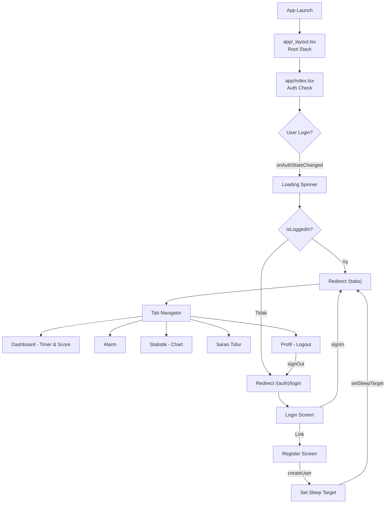

# 🔍 Investigasi Menyeluruh: SleepTrack App

---

## 1. Apa Itu SleepTrack?

**SleepTrack** adalah aplikasi mobile **pelacak kualitas tidur** (Sleep Tracker) yang dibangun dengan:
- **Framework**: Expo SDK 54 + React Native 0.81.5
- **Routing**: Expo Router (file-based routing)
- **State Management**: Zustand 5.x
- **Backend/Auth**: Firebase 12.15.0 (Authentication + Firestore)
- **Bahasa**: TypeScript
- **UI Components**: react-native-reanimated, react-native-gifted-charts, Ionicons

### Fitur Utama:
| Fitur | Deskripsi |
|---|---|
| 🔐 Login/Register | Autentikasi email+password via Firebase Auth |
| 🎯 Set Sleep Target | Pengguna memilih target jam tidur ideal (6–9 jam) |
| ⏱️ Sleep Timer | Timer untuk mencatat durasi tidur dengan animasi pulse |
| 📊 Sleep Score | Skor kualitas tidur (0–100) berdasarkan durasi vs target dan waktu mulai tidur |
| 📈 Statistik | Grafik bar 7 hari terakhir (masih dummy data) |
| ⏰ Alarm | Pengaturan alarm bangun (masih dummy data) |
| 💡 Saran Tidur | Tips kesehatan tidur (static content) |
| 👤 Profil | Pengaturan notifikasi, dark mode, logout |

---

## 2. Struktur Folder

```
SleepTrack/
├── SleepTrack/                     ← Project Expo utama
│   ├── app/                        ← Expo Router pages
│   │   ├── _layout.tsx             ← Root layout (Stack)
│   │   ├── index.tsx               ← Entry point (auth check → redirect)
│   │   ├── (auth)/                 ← Auth group (Stack)
│   │   │   ├── _layout.tsx
│   │   │   ├── login.tsx
│   │   │   ├── register.tsx
│   │   │   └── set-sleep-target.tsx
│   │   └── (tabs)/                 ← Tab group (Bottom Tabs)
│   │       ├── _layout.tsx
│   │       ├── index.tsx           ← Dashboard (Home)
│   │       ├── alarm.tsx
│   │       ├── statistics.tsx
│   │       ├── advice.tsx
│   │       └── profile.tsx
│   ├── components/
│   │   ├── SleepChart.tsx          ← Bar chart (gifted-charts)
│   │   ├── SleepScoreCard.tsx      ← Kartu skor tidur
│   │   ├── SleepTimer.tsx          ← Timer animasi (reanimated)
│   │   ├── ThemedText.tsx
│   │   ├── ThemedView.tsx
│   │   └── ui/                     ← Kosong
│   ├── constants/
│   │   └── colors.ts               ← Design tokens (dark/light)
│   ├── hooks/
│   │   ├── useColorScheme.ts       ← Re-export dari react-native
│   │   ├── useSleepSession.ts      ← Logic start/stop tracking tidur
│   │   └── useThemeColor.ts        ← Theme color resolver
│   ├── lib/
│   │   └── firebase.ts             ← Firebase init (auth + firestore)
│   ├── services/
│   │   └── sleep.service.ts        ← CRUD Firestore + scoring algorithm
│   ├── store/
│   │   └── sleepStore.ts           ← Zustand store (settings + sessions)
│   ├── types/
│   │   └── sleep.types.ts          ← TypeScript types
│   ├── assets/
│   │   ├── images/                 ← icon.png, splash, adaptive-icon, etc.
│   │   └── fonts/                  ← KOSONG (tidak ada custom font)
│   ├── app.json                    ← Expo config
│   ├── package.json
│   ├── tsconfig.json
│   ├── metro.config.js
│   ├── test-firebase.mjs           ← Script test login Firebase
│   └── test-register.mjs           ← Script test register Firebase
└── stitch_sleeptrack_dark_mode_app/ ← Folder referensi (tidak dipakai)
```

---

## 3. Konfigurasi Firebase

### Firebase Project Info
| Parameter | Nilai |
|---|---|
| Project ID | `sleeptrack-8caaf` |
| Auth Domain | `sleeptrack-8caaf.firebaseapp.com` |
| Database URL | `https://sleeptrack-8caaf-default-rtdb.asia-southeast1.firebasedatabase.app` |
| App ID | `1:346304438863:web:fd9124f4ba24c9d2b1403a` |

### Layanan Firebase yang Digunakan
1. **Authentication** → Email/Password (✅ Sudah aktif — terbukti berhasil register via `test-register.mjs`)
2. **Firestore** → Collection `sleep_sessions` (⚠️ belum diverifikasi apakah Firestore sudah dibuat/aktif)
3. **Realtime Database** → Ada config URL tapi **tidak digunakan** di kode manapun

### Verifikasi Firebase
```
✅ Register test: test1782459242495@test.com → BERHASIL
✅ Firebase API Key dan project config → VALID
⚠️ Firestore database → BELUM DIVERIFIKASI apakah sudah di-create di console
```

---

## 4. Alur Navigasi App



---

## 5. Versi Package Terinstal (Aktual)

| Package | Versi | Status |
|---|---|---|
| `expo` | 54.0.35 | ✅ |
| `react-native` | 0.81.5 | ✅ |
| `firebase` | 12.15.0 | ⚠️ Lihat masalah di bawah |
| `react-native-reanimated` | **4.1.7** | 🔴 **MASALAH KRITIS** |
| `react-native-gifted-charts` | 1.4.77 | ✅ |
| `expo-linear-gradient` | 15.0.8 | ✅ |
| `date-fns` | 4.4.0 | ✅ |
| `zustand` | 5.0.14 | ✅ |
| Expo compatibility check | — | ✅ Semua up to date |

---

## 6. Masalah yang Ditemukan

### 🔴 MASALAH KRITIS (App Crash / Tidak Bisa Jalan)

---

#### MASALAH #1: `react-native-reanimated` v4 Crash di Expo Go

> [!CAUTION]
> Ini adalah penyebab utama "Something went wrong" di Android

**File**: [SleepTimer.tsx](file:///d:/File/Mobile%20app/SleepTrack/SleepTrack/components/SleepTimer.tsx#L3)

**Masalah**: `react-native-reanimated` v4.1.7 membutuhkan **native TurboModules** (`installTurboModule`) yang **TIDAK tersedia di Expo Go**. Expo Go hanya support pre-bundled native modules. Reanimated v4 membutuhkan **development build** (custom native binary).

**Error yang muncul**:
```
ERROR [Error: Exception in HostFunction: TurboModule method "installTurboModule" 
called with 1 arguments (expected argument count: 0).]
```

**Impact**: Karena `SleepTimer.tsx` import dari `react-native-reanimated`, dan `SleepTimer` dipakai di `(tabs)/index.tsx`, maka:
- Tab Dashboard crash → "Route missing default export"
- Seluruh tab navigator tidak bisa dimuat
- App menampilkan layar error/white screen

**Solusi**: 
- **Opsi A** (Sederhana): Downgrade ke `react-native-reanimated ~3.16.x` yang masih kompatibel dengan Expo Go
- **Opsi B** (Advanced): Buat development build (`npx expo run:android`) — butuh Android Studio setup

---

#### MASALAH #2: Firebase Auth Persistence TIDAK TERSEDIA di Firebase v12

> [!CAUTION]
> `getReactNativePersistence` TIDAK ADA di Firebase 12.15.0

**File**: [firebase.ts](file:///d:/File/Mobile%20app/SleepTrack/SleepTrack/lib/firebase.ts)

**Masalah**: Kode saat ini menggunakan `getAuth(app)` biasa, yang berarti **auth state TIDAK di-persist** di React Native. Setiap kali app di-restart, user harus login ulang.

**Detail investigasi**:
```
✅ initializeAuth       → TERSEDIA (function)
❌ getReactNativePersistence → UNDEFINED (tidak ada di firebase/auth)
❌ firebase/auth/react-native → ERR_PACKAGE_PATH_NOT_EXPORTED
```

Firebase v12+ mengubah export structure — `getReactNativePersistence` tidak lagi di-export dari `firebase/auth`. Ini membuat auth persistence di React Native **tidak bisa diimplementasikan** dengan Firebase v12.

**Solusi**: 
- **Opsi A**: Downgrade Firebase ke v10.x (`firebase@^10.14.0`) dimana `getReactNativePersistence` masih tersedia
- **Opsi B**: Gunakan `@react-native-firebase/app` + `@react-native-firebase/auth` (native SDK, bukan web SDK)
- **Opsi C**: Implementasi manual persistence menggunakan AsyncStorage + `onAuthStateChanged`

---

#### MASALAH #3: `useSleepSession` Hook TIDAK DIGUNAKAN

> [!WARNING]
> Sleep tracking TIDAK BERFUNGSI karena hook yang ada tidak dipakai

**File**: [useSleepSession.ts](file:///d:/File/Mobile%20app/SleepTrack/SleepTrack/hooks/useSleepSession.ts) vs [(tabs)/index.tsx](file:///d:/File/Mobile%20app/SleepTrack/SleepTrack/app/(tabs)/index.tsx)

**Masalah**: Dashboard (`(tabs)/index.tsx`) membuat state `isTracking` sendiri secara lokal:
```tsx
// Dashboard: LOKAL state — tidak terhubung ke Firestore
const [isTracking, setIsTracking] = useState(false);

<SleepTimer
  isTracking={isTracking}
  onStart={() => setIsTracking(true)}   // ← Hanya toggle boolean
  onStop={() => setIsTracking(false)}   // ← Tidak simpan ke Firestore!
/>
```

Padahal sudah ada hook `useSleepSession` yang lengkap:
```tsx
// Hook yang SEHARUSNYA dipakai:
const { isTracking, startSleep, stopSleep } = useSleepSession();
// startSleep → catat waktu mulai
// stopSleep → hitung skor, simpan ke Firestore
```

**Impact**: Tombol "Mulai Tidur" / "Bangun" hanya mengoperasikan timer visual — **TIDAK ADA data yang disimpan ke Firestore**.

---

### 🟠 MASALAH SIGNIFIKAN (Fitur Tidak Berfungsi Semestinya)

---

#### MASALAH #4: Statistik Menggunakan Data Dummy (Hardcoded)

**File**: [statistics.tsx](file:///d:/File/Mobile%20app/SleepTrack/SleepTrack/app/(tabs)/statistics.tsx#L9-L18)

**Masalah**: Halaman statistik tidak mengambil data dari Firestore. Data sepenuhnya hardcoded:
```tsx
const DUMMY_DATA = [
  { day: 'Sen', hours: 6.5, score: 72 },
  { day: 'Sel', hours: 7.2, score: 81 },
  // ... hardcoded
];
```

**Seharusnya**: Memanggil `getSleepSessions()` dari `sleep.service.ts` yang sudah ada.

---

#### MASALAH #5: Alarm Tidak Berfungsi (Dummy + Tidak Ada Logic)

**File**: [alarm.tsx](file:///d:/File/Mobile%20app/SleepTrack/SleepTrack/app/(tabs)/alarm.tsx)

**Masalah**: 
- Data alarm hardcoded (`DUMMY_ALARMS`)
- Tombol "Tambah" tidak melakukan apapun (no `onPress` handler)
- Toggle switch hanya mengubah local state — tidak ada integrasi dengan `expo-notifications`
- Tidak ada scheduling alarm yang sebenarnya

---

#### MASALAH #6: Dark Mode Switch Tidak Bekerja

**File**: [profile.tsx](file:///d:/File/Mobile%20app/SleepTrack/SleepTrack/app/(tabs)/profile.tsx#L72-L80) + [_layout.tsx](file:///d:/File/Mobile%20app/SleepTrack/SleepTrack/app/_layout.tsx#L14)

**Masalah**: Di Profil ada toggle dark mode yang menyimpan ke Zustand/AsyncStorage:
```tsx
<Switch value={darkMode} onValueChange={setDarkMode} />
```

Tapi di Root Layout, tema diambil dari **system setting** (bukan dari store):
```tsx
const colorScheme = useColorScheme(); // ← Dari React Native (system)
<ThemeProvider value={colorScheme === 'dark' ? DarkTheme : DefaultTheme}>
```

**Impact**: Toggle dark mode di profil tidak punya efek apapun pada UI.

---

#### MASALAH #7: Waktu Tidur Ideal di Dashboard adalah Hardcoded

**File**: [(tabs)/index.tsx](file:///d:/File/Mobile%20app/SleepTrack/SleepTrack/app/(tabs)/index.tsx#L46-L48)

**Masalah**:
```tsx
<ThemedText style={styles.highlight}>22:00</ThemedText> untuk bangun pukul{' '}
<ThemedText style={styles.highlight}>06:00</ThemedText>.
```

Waktu 22:00 dan 06:00 di-hardcode. Seharusnya dihitung berdasarkan `sleepTarget` user.

---

### 🟡 MASALAH MINOR

---

#### MASALAH #8: `fonts/` Folder Kosong

**Path**: `assets/fonts/` → **Kosong**

**Impact**: App menggunakan system font default. Tidak kritis tapi mengurangi konsistensi UI.

---

#### MASALAH #9: Greeting Message Selalu "Selamat Malam"

**File**: [(tabs)/index.tsx](file:///d:/File/Mobile%20app/SleepTrack/SleepTrack/app/(tabs)/index.tsx#L22)

```tsx
<ThemedText type="title" style={styles.greeting}>Selamat malam 🌙</ThemedText>
```

Tidak menyesuaikan dengan waktu sehari (pagi/siang/sore/malam).

---

## 7. Ringkasan Status

| Aspek | Status | Detail |
|---|---|---|
| **Build/Bundle** | 🔴 Crash | Reanimated v4 crash di Expo Go |
| **Firebase Auth** | 🟡 Parsial | Login/register berfungsi tapi tanpa persistence |
| **Firebase Firestore** | 🟡 Tidak terpakai | Service ada tapi tidak dipanggil dari UI |
| **Sleep Tracking** | 🔴 Tidak berfungsi | Hook `useSleepSession` tidak dipakai |
| **Statistik** | 🟡 Dummy | Data hardcoded, tidak dari Firestore |
| **Alarm** | 🔴 Tidak berfungsi | Dummy data, tidak ada scheduling |
| **Dark Mode** | 🔴 Tidak berfungsi | Toggle tidak terhubung ke theme system |
| **UI/Design** | 🟢 Baik | Design system solid, dark theme konsisten |
| **Folder Structure** | 🟢 Baik | Clean architecture, proper separation |

---

## 8. Prioritas Perbaikan (Rekomendasi)

1. **🔴 FIX Reanimated** → Downgrade ke v3.x agar app bisa jalan di Expo Go
2. **🔴 FIX Sleep Tracking** → Hubungkan `useSleepSession` hook ke Dashboard
3. **🟠 FIX Firebase Auth Persistence** → Downgrade Firebase atau implementasi manual
4. **🟠 FIX Statistik** → Ambil data real dari Firestore
5. **🟠 FIX Dark Mode** → Hubungkan store darkMode ke ThemeProvider
6. **🟡 FIX Alarm** → Implementasi dengan expo-notifications
7. **🟡 FIX Dynamic Content** → Greeting dinamis, waktu tidur ideal dihitung

> [!IMPORTANT]
> **Langkah pertama yang WAJIB dilakukan**: Downgrade `react-native-reanimated` ke v3.x agar app bisa dijalankan di Expo Go. Tanpa ini, TIDAK ADA fitur yang bisa ditest/dijalankan.
